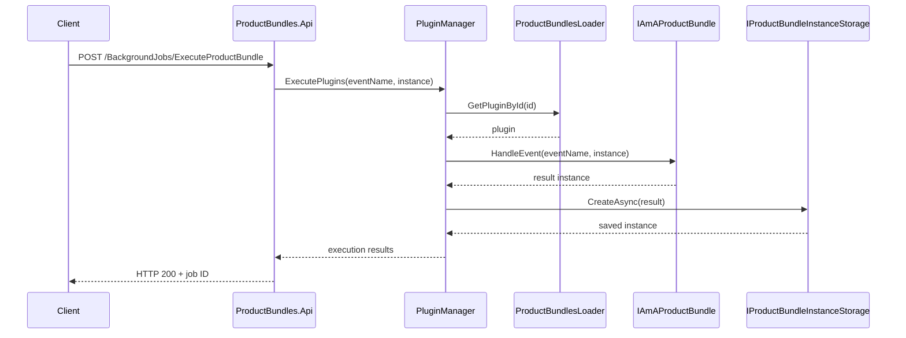
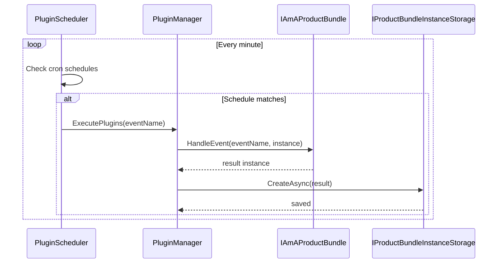
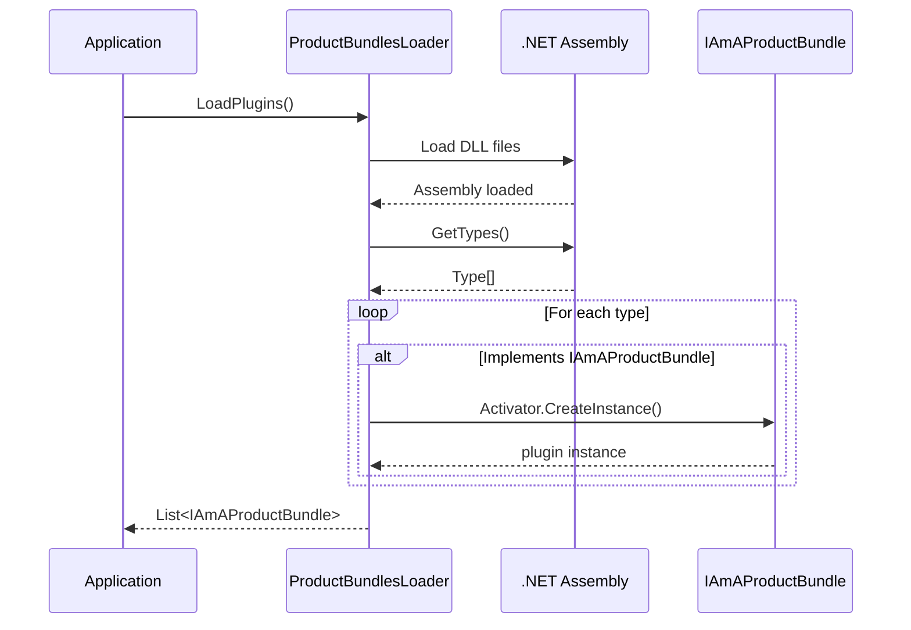
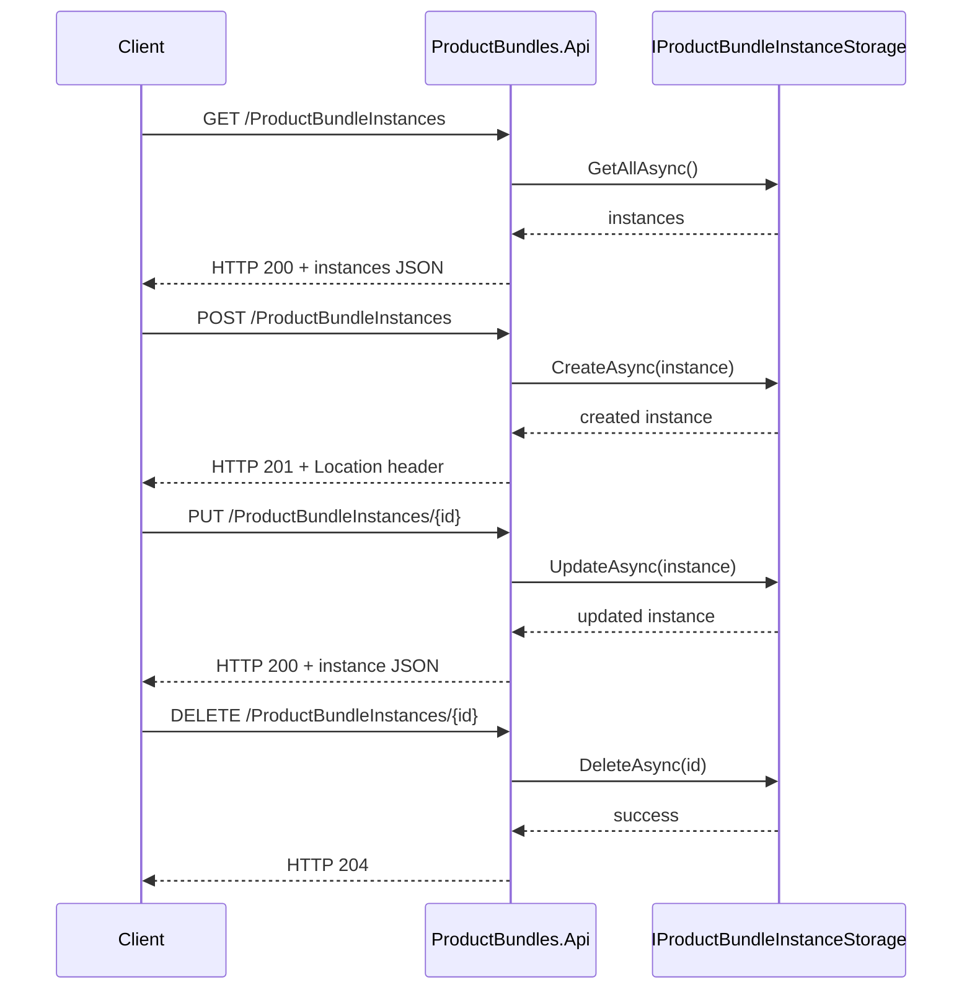

# ProductBundles Platform

A comprehensive event-driven plugin platform for .NET that enables dynamic loading, execution, and management of ProductBundle plugins. The platform provides REST APIs, background job processing, scheduled execution, multiple storage backends, and a flexible event-driven architecture.

## Main Use Cases

The ProductBundles platform is designed for enterprise automation and integration scenarios:

### **Business Process Automation**
- **Invoice Processing**: Automatically process incoming invoices, extract data, validate against purchase orders, and route for approval
- **Customer Onboarding**: Automated workflows that collect customer data, verify information, create accounts, and send welcome materials
- **Document Management**: Automatically categorize, tag, and archive documents based on content analysis

### **System Integration & Data Synchronization**
- **CRM Synchronization**: Keep customer data synchronized between Salesforce, HubSpot, and internal systems
- **Inventory Management**: Real-time synchronization between e-commerce platforms, warehouses, and accounting systems
- **Multi-Platform Publishing**: Automatically publish content to websites, social media, and marketing platforms

### **Monitoring & Alerting Systems**
- **Infrastructure Monitoring**: Check server health, database performance, and application status with scheduled health checks
- **Business Metrics Tracking**: Monitor KPIs, sales targets, and operational metrics with automated reporting
- **Security Monitoring**: Detect suspicious activities, failed login attempts, and system vulnerabilities

### **E-commerce & Retail Operations**
- **Price Monitoring**: Track competitor prices and automatically adjust pricing strategies
- **Order Fulfillment**: Coordinate between payment processing, inventory allocation, and shipping providers
- **Customer Support**: Route support tickets, escalate urgent issues, and provide automated responses

## Architecture

The ProductBundles platform follows a layered architecture with clear separation of concerns:

```
┌─────────────────────────────────────────────────────────────┐
│                     REST API Layer                         │
│  ProductBundles.Api - HTTP endpoints, Swagger, Hangfire    │
└─────────────────────────────────────────────────────────────┘
┌─────────────────────────────────────────────────────────────┐
│                   Service Layer                            │
│  Background Jobs, Scheduling, Plugin Management            │
└─────────────────────────────────────────────────────────────┘
┌─────────────────────────────────────────────────────────────┐
│                     Core Layer                             │
│  ProductBundles.Core - Plugin Loading, Execution, Storage  │
└─────────────────────────────────────────────────────────────┘
┌─────────────────────────────────────────────────────────────┐
│                   SDK Layer                                │
│  ProductBundles.Sdk - Interfaces, Models, Contracts       │
└─────────────────────────────────────────────────────────────┘
```

### **Core Components**

1. **ProductBundles.Sdk**: Plugin development SDK
   - `IAmAProductBundle`: Main plugin interface
   - `ProductBundleInstance`: Data model for plugin instances
   - `Property`: Configuration property definitions
   - `RecurringBackgroundJob`: Background job scheduling support

2. **ProductBundles.Core**: Core plugin infrastructure
   - `ProductBundlesLoader`: Dynamic plugin loading via reflection
   - `PluginManager`: Plugin lifecycle management
   - `PluginScheduler`: Cron-based scheduling with real-time execution
   - **Storage**: Multiple backends (File System, MongoDB) with CRUD operations
   - **Serialization**: JSON-based serialization with configurable options

3. **ProductBundles.Api**: REST API and background processing
   - **CRUD Endpoints**: Complete REST API for ProductBundle and ProductBundleInstance management
   - **Background Jobs**: Hangfire integration for async processing
   - **Swagger Documentation**: OpenAPI specifications with interactive documentation

4. **ProductBundles.PluginLoader**: Console application for testing and demonstration

### **Entity Source System**

The Entity Source system provides event-driven integration capabilities, allowing external systems to trigger ProductBundle processing based on entity lifecycle events (create, update, delete).

#### **Architecture Overview**

```
┌─────────────────┐    Events    ┌──────────────────────┐    Processes    ┌─────────────────────┐
│  Entity Sources │ ──────────→  │ EntitySourceManager  │ ──────────────→ │ ProductBundle       │
│ (CustomerSource)│              │                      │                 │ Plugins             │
└─────────────────┘              └──────────────────────┘                 └─────────────────────┘
        │                                    │                                        │
        │ Generate                          │ Dispatch                              │ HandleEvent()
        ▼                                    ▼                                        ▼
┌─────────────────┐              ┌──────────────────────┐                 ┌─────────────────────┐
│EntityChangeEvent│              │ProductBundleBackground│                │ Enriched Instance   │
│     Args        │              │     Service          │                 │ + Entity Data       │
└─────────────────┘              └──────────────────────┘                 └─────────────────────┘
```

#### **Core Components**

**1. IAmAnEntitySource Interface**
- Base interface for all entity sources
- Properties: `Id`, `FriendlyName`, `IsActive`
- Events: `EntityChanged` - fired when entities change
- Methods: `StartAsync()`, `StopAsync()` - lifecycle management

**2. EntitySourceManager**
- Manages multiple entity sources
- Orchestrates event dispatch to ProductBundle processing
- Thread-safe event handling with comprehensive logging
- Integrates with `IBackgroundJobProcessor` for async processing

**3. EntityChangeEventArgs**
- Standard event data structure for all entity changes
- Properties: `EntityType`, `EntityId`, `EventType`, `Timestamp`
- `EntityData`: Dictionary of entity property data
- `Metadata`: Additional event metadata

**4. CustomerEventSource (Example Implementation)**
- Example entity source for customer lifecycle events
- Simulation methods: `SimulateCustomerCreated()`, `SimulateCustomerUpdated()`, `SimulateCustomerDeleted()`
- Configurable source ID and comprehensive logging

#### **Event Processing Flow**

1. **Entity Change Occurs**: External system triggers entity source
2. **Event Generation**: Entity source creates `EntityChangeEventArgs`
3. **Event Dispatch**: `EntitySourceManager` receives and dispatches event
4. **Plugin Processing**: `ProductBundleBackgroundService.ProcessEntityEventAsync()` processes all ProductBundle instances
5. **Data Enrichment**: Each instance receives enriched data with entity information:
   - `_entityType`: Type of entity (e.g., "Customer")
   - `_entityId`: Unique identifier of changed entity
   - `_eventType`: Event type ("Created", "Updated", "Deleted")
   - `_eventTimestamp`: When the change occurred
   - `_entity_{key}`: Entity property data with prefix
   - `_meta_{key}`: Event metadata with prefix

#### **Plugin Integration**

ProductBundle plugins receive entity events through the `HandleEvent()` method:

```csharp
public ProductBundleInstance HandleEvent(string eventName, ProductBundleInstance bundleInstance)
{
    // eventName format: "entity.{EventType}" (e.g., "entity.Created")
    
    // Access entity data from enriched instance
    var entityType = bundleInstance.Properties["_entityType"]?.ToString();
    var entityId = bundleInstance.Properties["_entityId"]?.ToString();
    var eventType = bundleInstance.Properties["_eventType"]?.ToString();
    
    // Access entity properties
    var customerName = bundleInstance.Properties["_entity_Name"]?.ToString();
    var customerEmail = bundleInstance.Properties["_entity_Email"]?.ToString();
    
    // Process the event and return updated instance
    var result = new ProductBundleInstance(/*...*/);
    result.Properties["processedEntityEvent"] = true;
    result.Properties["processedAt"] = DateTime.UtcNow;
    
    return result;
}
```

#### **Configuration & Usage**

**1. Register Entity Sources**
```csharp
var entitySourceManager = new EntitySourceManager(logger);
var customerSource = new CustomerEventSource(logger, "customer-source-1");

await entitySourceManager.RegisterSourceAsync(customerSource);
await entitySourceManager.StartAllSourcesAsync();
```

**2. Trigger Events Programmatically**
```csharp
// Simulate customer creation
await customerSource.SimulateCustomerCreated("CUST001", new Dictionary<string, object?>
{
    ["Name"] = "John Doe",
    ["Email"] = "john.doe@example.com",
    ["Status"] = "Active"
});
```

**3. Integration with Background Processing**
```csharp
// Entity source manager automatically dispatches to background service
entitySourceManager.EntityEventProcessed += async (sender, args) =>
{
    await backgroundJobProcessor.ProcessEntityEventAsync(args);
};
```

#### **Benefits**

- **Event-Driven Architecture**: Reactive processing based on real-world entity changes
- **Scalable Processing**: Handles large numbers of ProductBundle instances with pagination
- **Data Enrichment**: Plugins receive both their instance data and entity change context
- **Error Isolation**: Individual plugin failures don't affect other plugins
- **Comprehensive Logging**: Full audit trail of entity events and processing
- **Extensible Design**: Easy to add new entity types and sources
- **Async Processing**: Non-blocking event processing for high throughput

### **Storage Architecture**

The platform supports multiple storage backends through dependency injection:

```
IProductBundleInstanceStorage
├── FileSystemProductBundleInstanceStorage (File-based storage)
└── MongoProductBundleInstanceStorage (MongoDB-based storage)
```

### **Background Job Processing**

Powered by Hangfire with multiple job queues:
- **productbundles**: Plugin execution jobs
- **scheduled**: Scheduled plugin processing  
- **maintenance**: Bulk operations and maintenance tasks

## Main Workflows

### Plugin Execution Workflow



### Scheduled Plugin Workflow



### Plugin Loading Workflow



### CRUD API Workflow



## Setup Instructions

### Prerequisites
- .NET 8.0 SDK or later
- Optional: MongoDB (for MongoDB storage backend)

### 1. Clone and Build

```bash
# Clone the repository
git clone <repository-url>
cd windsurf-project

# Build all projects
dotnet build

# Build plugins
./build-plugins.sh

# Run tests
./run-tests-with-coverage.sh
```

### 2. Run the Console Application

```bash
# Run the console demonstration
dotnet run --project ProductBundles.PluginLoader
```

### 3. Run the REST API

```bash
# Start the API server
dotnet run --project ProductBundles.Api

# API will be available at:
# - http://localhost:5077
# - Swagger UI: http://localhost:5077/swagger
# - Hangfire Dashboard: http://localhost:5077/hangfire
```

### 4. Configure Storage Backend

#### File System Storage (Default)
```csharp
services.AddProductBundleInstanceServices(
    Path.Combine(Directory.GetCurrentDirectory(), "storage"));
```

#### MongoDB Storage
```csharp
services.AddProductBundleInstanceMongoStorage(
    "mongodb://localhost:27017", 
    "ProductBundles");
```

### 5. Environment Configuration

Create `appsettings.json` in ProductBundles.Api:
```json
{
  "ConnectionStrings": {
    "DefaultStorage": "filesystem:./storage",
    "MongoDB": "mongodb://localhost:27017"
  },
  "Logging": {
    "LogLevel": {
      "Default": "Information"
    }
  }
}
```

## How to Create a Plugin

### 1. Create a New Class Library

```bash
# Create new plugin project
dotnet new classlib -n MyCustomPlugin
cd MyCustomPlugin

# Add reference to ProductBundles.Sdk
dotnet add reference ../ProductBundles.Sdk/ProductBundles.Sdk.csproj
```

### 2. Implement the IAmAProductBundle Interface

```csharp
using ProductBundles.Sdk;

namespace MyCustomPlugin
{
    public class MyBusinessPlugin : IAmAProductBundle
    {
        public string Id => "mybusinessplugin";
        public string FriendlyName => "My Business Plugin";
        public string Description => "Handles custom business logic automation";
        public string Version => "1.0.0";
        
        // Define plugin properties
        public IReadOnlyList<Property> Properties => new[]
        {
            new Property("ApiEndpoint", "External API endpoint URL", "https://api.example.com", true),
            new Property("BatchSize", "Processing batch size", 100, false),
            new Property("TimeoutSeconds", "Request timeout in seconds", 30, false)
        };

        // Define scheduled execution (optional)
        public string? Schedule => "0 */6 * * *"; // Every 6 hours

        // Define recurring background jobs (optional)
        public IReadOnlyList<RecurringBackgroundJob> RecurringBackgroundJobs => new[]
        {
            new RecurringBackgroundJob(
                "data-sync", 
                "*/30 * * * *", // Every 30 minutes
                "Synchronize data with external systems",
                new Dictionary<string, object?> { ["eventName"] = "data.sync" }
            ),
            new RecurringBackgroundJob(
                "health-check",
                "*/5 * * * *", // Every 5 minutes
                "Check system health and connectivity",
                new Dictionary<string, object?> { ["eventName"] = "health.check" }
            )
        };

        public void Initialize()
        {
            Console.WriteLine($"[{FriendlyName}] Initializing plugin...");
            // Initialize resources, connections, etc.
        }

        public ProductBundleInstance HandleEvent(string eventName, ProductBundleInstance bundleInstance)
        {
            Console.WriteLine($"[{FriendlyName}] Handling event: {eventName}");
            
            // Create result instance
            var result = new ProductBundleInstance(
                Guid.NewGuid().ToString(),
                bundleInstance.ProductBundleId,
                bundleInstance.ProductBundleVersion
            );

            try
            {
                switch (eventName)
                {
                    case "data.sync":
                        HandleDataSync(bundleInstance, result);
                        break;
                    case "health.check":
                        HandleHealthCheck(bundleInstance, result);
                        break;
                    case "system.startup":
                    default:
                        HandleDefaultExecution(bundleInstance, result);
                        break;
                }

                result.Properties["status"] = "success";
                result.Properties["eventName"] = eventName;
                result.Properties["executionTime"] = DateTime.UtcNow;
            }
            catch (Exception ex)
            {
                result.Properties["status"] = "error";
                result.Properties["error"] = ex.Message;
                result.Properties["eventName"] = eventName;
            }

            return result;
        }

        private void HandleDataSync(ProductBundleInstance input, ProductBundleInstance result)
        {
            // Implement data synchronization logic
            var apiEndpoint = input.Properties["ApiEndpoint"]?.ToString();
            var batchSize = Convert.ToInt32(input.Properties["BatchSize"] ?? 100);
            
            // Your business logic here
            result.Properties["syncedRecords"] = 150;
            result.Properties["endpoint"] = apiEndpoint;
        }

        private void HandleHealthCheck(ProductBundleInstance input, ProductBundleInstance result)
        {
            // Implement health check logic
            result.Properties["systemStatus"] = "healthy";
            result.Properties["lastCheck"] = DateTime.UtcNow;
        }

        private void HandleDefaultExecution(ProductBundleInstance input, ProductBundleInstance result)
        {
            // Default execution logic
            result.Properties["defaultExecution"] = true;
        }

        public void Dispose()
        {
            Console.WriteLine($"[{FriendlyName}] Disposing resources...");
            // Clean up resources
        }
    }
}
```

### 3. Build and Deploy

```bash
# Build your plugin
dotnet build

# Copy to plugins directory
cp bin/Debug/net8.0/MyCustomPlugin.dll ../plugins/

# Your plugin will be automatically loaded by the platform
```

### 4. Test Your Plugin

#### Console Testing
```bash
dotnet run --project ProductBundles.PluginLoader
```

#### API Testing
```bash
# Get all plugins
curl http://localhost:5077/ProductBundles

# Execute your plugin
curl -X POST http://localhost:5077/BackgroundJobs/ExecuteProductBundle \
  -H "Content-Type: application/json" \
  -d '{"pluginId": "mybusinessplugin", "eventName": "data.sync"}'
```

### 5. Advanced Plugin Features

#### Event-Driven Architecture
Your plugin can handle multiple event types:
```csharp
public ProductBundleInstance HandleEvent(string eventName, ProductBundleInstance bundleInstance)
{
    return eventName switch
    {
        "user.created" => HandleUserCreated(bundleInstance),
        "order.placed" => HandleOrderPlaced(bundleInstance),
        "payment.processed" => HandlePaymentProcessed(bundleInstance),
        _ => HandleDefaultEvent(bundleInstance)
    };
}
```

#### Complex Properties
```csharp
public IReadOnlyList<Property> Properties => new[]
{
    new Property("DatabaseConnection", "Database connection string", "", true),
    new Property("RetryPolicy", "Retry configuration", new { maxRetries = 3, delayMs = 1000 }, false),
    new Property("EmailSettings", "Email configuration", new 
    { 
        smtpServer = "smtp.example.com", 
        port = 587,
        enableSsl = true 
    }, false)
};
```

#### Multiple Recurring Jobs
```csharp
public IReadOnlyList<RecurringBackgroundJob> RecurringBackgroundJobs => new[]
{
    new RecurringBackgroundJob("hourly-report", "0 * * * *", "Generate hourly reports"),
    new RecurringBackgroundJob("daily-cleanup", "0 2 * * *", "Daily maintenance tasks"),
    new RecurringBackgroundJob("weekly-backup", "0 1 * * 0", "Weekly data backup")
};
```

The ProductBundles platform provides a robust foundation for enterprise automation with comprehensive plugin support, background processing, multiple storage options, and a full REST API.
